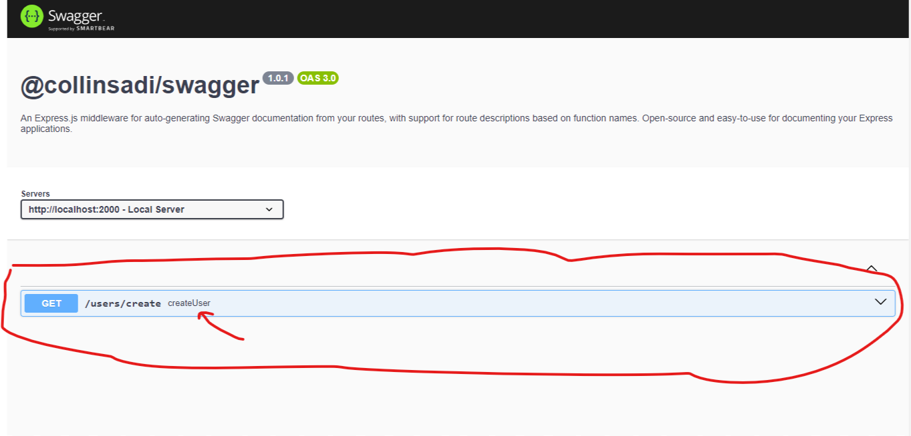

# @collinsadi/swagger


[](https://www.npmjs.com/package/%40collinsadi%2Fswagger)

🚀 `@collinsadi/swagger` is an npm package that automates the generation of Swagger documentation for Express.js applications. Document your routes with ease and share them with your team!

## Installation

You can install this package via npm:

```bash
npm install @collinsadi/swagger
```


## Usage

### Import the Package

```javascript
const generateSwaggerDocumentation = require("@collinsadi/swagger");
```

### Generate Swagger Documentation

```javascript
// Create an Express app
const express = require("express");
const app = express();

// Generate Swagger documentation for your Express app
generateSwaggerDocumentation(app, port, live);
```

- `app`: Your Express application.
- `port`: The port on which your server is running.
- `live`: Optional. The deployment server URL.

👉 **Note:** `@collinsadi/swagger` takes the name of the function assigned to the routes as a description for the route. Currently, it supports routes declared in the `app.js`. Stay tuned for future updates to expand support to routes imported from other files.

### Swagger UI

After generating the Swagger documentation, you can view it using Swagger UI by navigating to:

```
http://your-server/docs
```


## Example

```javascript
// Create an Express app
const express = require("express");
const generateSwaggerDocumentation = require("@collinsadi/swagger");
const app = express();


app.listen(2000, () => {
    
    console.log("Server Started")
})

const createUser = (req, res)=>{

    res.send("User Created")

}

app.get("/users/create", createUser)

// Generate Swagger documentation for your Express app
generateSwaggerDocumentation(app, 2000, "https://collinsadi.vercel.app");


```




🌟 We welcome contributions! This project is open source and open for collaboration. Feel free to contribute, report issues, and help improve this package.

## Features To Be Implemented

We have exciting plans for the future of `@collinsadi/swagger`, including:

- Support for routes imported from external files.
- Enhanced configuration options for fine-tuning your documentation.
- Integration with additional tools and frameworks.

Stay tuned for these upcoming features and be part of our open-source journey!

## License

This project is licensed under the MIT License. See the [LICENSE](LICENSE) file for details.

## Author

- [Collins Adi](https://github.com/collinsadi)

🌍 Connect with us on GitHub and let's make Swagger documentation a breeze!
